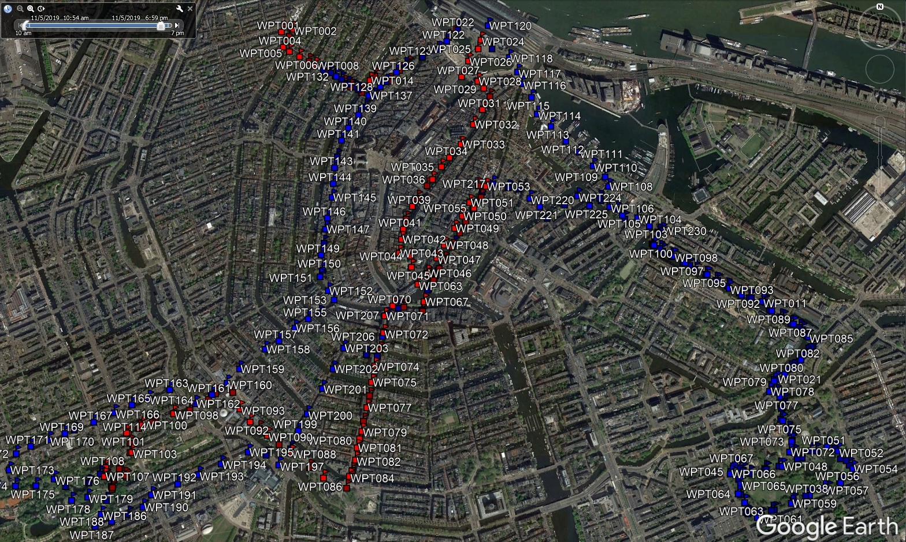
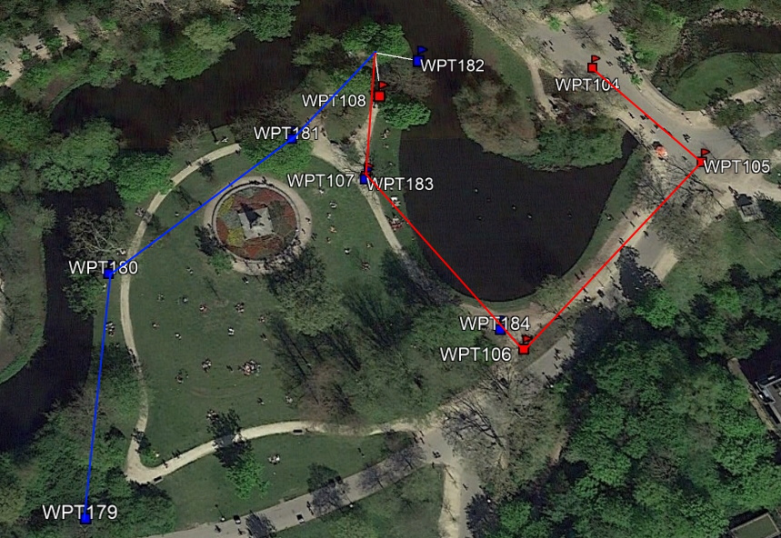

### Assignment
We confiscated the phones of two suspects. We think they have met. Can you find out where exactly?

### GPX files
Both of the given .gpx files contain a set of **timestamped waypoints**. Using [Google Earth Pro](https://www.google.com/earth/versions/#earth-pro "Google Earth Pro") we can load the files and view the waypoints on a map. For readability I colored the waypoints from GPS 1.gpx red, and from GPS 1.gpx blue.

### Investigation
The sets of waypoints show a clear track within the city of Amsterdam. The timeline shows the timestamps are recorded from 11/05/2019 10:54 AM to 6:49 PM. Shortening the timespan to about 30 minutes, and moving through the time of the day shows that the two tracks end up colliding in the Vondelpark (red WPT108 and blue WPT182).

WPT108: 52.360531, 4.874528

WPT182: 52.360529, 4.874534

### Solution
The solution asks for a coordinate in the format: XX.XXXX;Y.YYYY. Filling in 52.3605;4.8745 confirms that we have the right coordinate.
