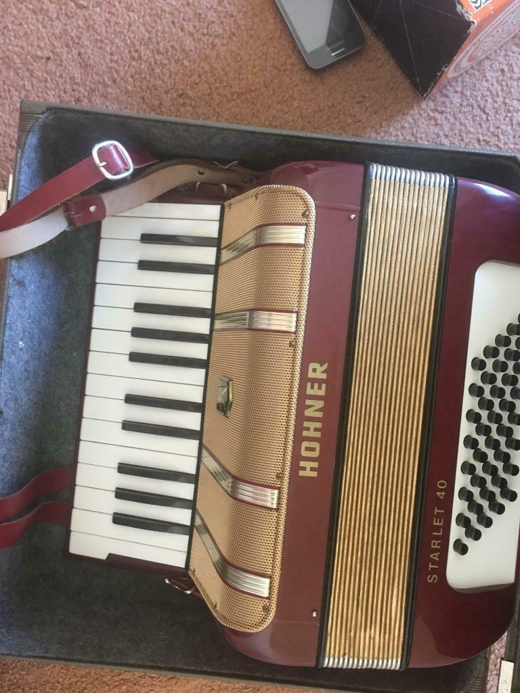

### Assignment
In a cyber crime case, a suspect with the e-mail address z3r0b3t404@gmail.com has been identified. Using OSINT, can you find the first and last name of the suspect?

### Google Hangouts
Using Google Hangouts we can add the e-mail address to our contacts. The contact then shows with "Zero Beta" as the name.

### Oberservations
The name "Zero Beta" tied to z3r0b3t403@gmail.com is a pseudonym which explains that the e-mail address is written in [“leetspeak”](https://en.wikipedia.org/wiki/Leet), in which it can be read as:  ZeroBeta04@gmail.com.

### Google
When we search for zerobeta04 on google we find a website [zerobeta04.nl](http://www.zerobeta04.nl/ "zerobeta04.nl").
The homepage of the website states in Dutch that it is under construction ("In aanbouw").
Crawling the webserver gives us a [webpage](http://www.zerobeta04.nl/notes.txt "webpage"), which contains the following text:

>Marktplaats:

>Boggle - moet nog

>Blackberry - https://www.marktplaats.nl/a/telecommunicatie/mobiele-telefoons-blackberry/m1451348153-pgp-blackberry.html

It looks like the website owner created a to do list, stating he/she wants to sell some items on [Marktplaats](https://www.marktplaats.nl/ "Marktplaats"), a Dutch advertising site.

### The marktplaats listing
Following the link in the note, we find a listing of a PGP Blackberry created at 30th of August 2019 @ 13:50.
The description of the listing shows the following text:
>Beschrijving

>Meerdere PGP-telefoons aangeboden.

>Merk BlackBerry. Verzending heel Nederland.

>Check ook mn andere advertenties (hohner starlet enz.)

>Moet overal van af.

The listing provides the following images:

The location of the advertisement is set to Stitswerd, Groningen.

The stated city, according to Wikipedia has a population of about 50 inhabitants and uses the postal code 9999. This indicates that the set location is a fluke.

The listing is created by the user **JG_zerobeta04**, who has been active on the website since May 2019.
The account does not have other listings, which is what we would not assume from the above description of the listing.

### The second Marktplaats account
When we search Marktplaats for "hohner starlet", we get the following [listing](https://www.marktplaats.nl/a/muziek-en-instrumenten/accordeons/m1451345767-accordeon-hohner-starlet.html?c=08c285449651fa109c354bbabe740c1b&previousPage=lr)

The listing is of an accordion, created at 30th of August 2019 @ 13:44.
The description of the listing shows the following text:
>Accordeon Hohner Starlet 40

The listing provides the following images:

The location of the listing is set to Almere, Flevoland.

The advertisement is created by the user **jiuseppegrande**, who has been active on the website since May 2019. This coincides with the creation date of the other marktplaats account.
The account also does not have other listings.

### Twitter account
From the username jiuseppegrande we can find a [twitter account](https://twitter.com/jiuseppe_grande)
The twitter account was created on April 2019 and follows all kinds of cyber security accounts.

Profile picture:

A tweet posted by the account reads the following:

>Iemand voor een potje boggle? anders gaat ie op marktplaats.

The author asks if anyone wants to play Boggle the word game with him, and says if he doesn't find anyone he will put it up on Marktplaats.

### Ello account
A [reverse image search](https://www.reverseimagesearch.com/) using his profile picture gives the following account of a [Josh Grootegast](https://ello.co/joshgrootegast) living in **Almere, Flevoland**.

The account has a post which reads as follows:

>Heb niemand gevonden om Boggle mee te spelen dus deze kan verkocht worden. Geïnteresseerde kopers kunnen mij bereiken via: z3r0.b3t4.04 AT gmail.com

Stating he has been unable to find someone to play Boggle with and therefore is selling it, and that he can be contacted at z3r0b3t404@gmail.com, **confirming that Josh Grootegast is z3r0b3t404@gmail.com**.
